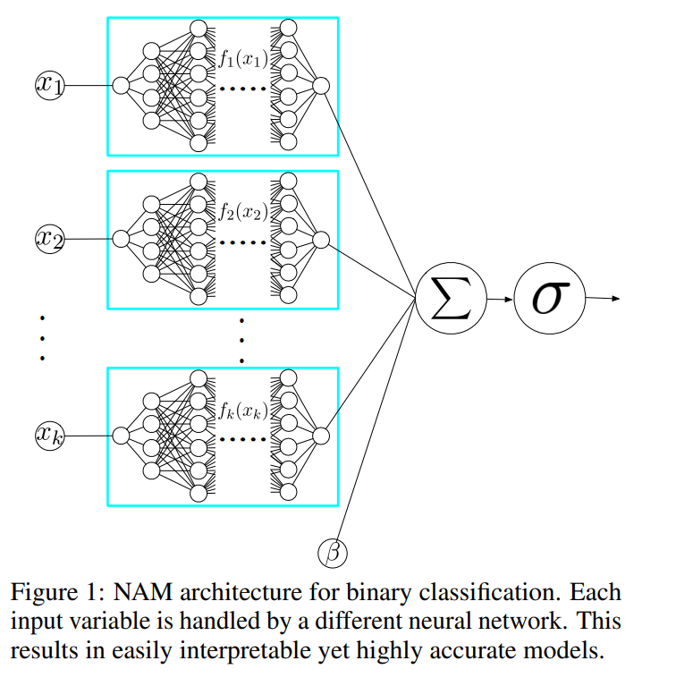

# Neural Additive Models in JAX

This repo contains JAX-based version of the model introduced in [Neural Additive Models: Interpretable Machine Learning with Neural Nets](https://arxiv.org/abs/2004.13912) by R. Agarwal et.al 2021. 

### Dependencies

 - jax
 - optax
 - haiku # used for implementing NN model
 - torch # used for creating mini-batches
 - numpy
 - scikit-learn

### Examples

Checkout the `nam_regression_example.ipynb` notebook to see an example of using the model for the California housing Dataset